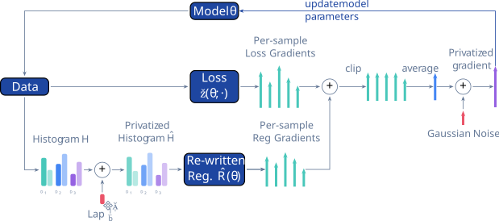

# Private Rate-Constrained Optimization

[](http://cleverhans.io/dp-raco/)

<p align="center">
  
</p>

`dpraco` is a research codebase for training classifiers with differential privacy and fairness constraints.
The examples in this repository focus on running DpRaco with tabular datasets and inspecting the privacy/fairness trade-offs.

## What is in this repository

- `src/dpraco/`: core implementation (data loaders, models, algorithms, training loop, accounting).
- `examples/`: notebook demos that run end-to-end experiments.
- `examples/conf/`: composable OmegaConf/Hydra-style configuration files used by the demos.
- `data/`: local dataset files used by the notebooks.

## Setup

This project uses `uv`.

```bash
uv sync --dev
```

Optional shell activation:

```bash
source .venv/bin/activate
```

You can also run commands without activating the environment by prefixing them with `uv run`.

## Examples

The `examples/` folder contains three notebooks:

- `examples/dpraco_adult_demographic_parity_demo.ipynb`  
  Runs DPRACO on Adult with a Demographic Parity constraint.
- `examples/dpraco_folktables_demographic_parity_demo.ipynb`  
  Runs DPRACO on Folktables with a Demographic Parity constraint.
- `examples/dpraco_heart_false_negative_rate_demo.ipynb`  
  Runs DPRACO on Heart with a False Negative Rate constraint.

### Important: launch notebooks from `examples/`

The notebooks resolve config paths relative to the current working directory (they expect `conf/` to be in that directory).
Start Jupyter from `examples/`:

```bash
cd examples
uv run jupyter lab
```

Then open one of the `dpraco_*_demo.ipynb` notebooks.

## How each demo is configured

Each notebook builds a runtime config by merging:

1. base config: `examples/conf/dpraco.yaml`
2. dataset config: `examples/conf/dataset/*.yaml`
3. algorithm config: `examples/conf/algorithm/*.yaml`
4. model config: `examples/conf/model/logistic_regression.yaml`
5. demo overrides: `examples/conf/demo/*.yaml`

The demo override files used by the notebooks are:

- `examples/conf/demo/adult_demographic_parity_demo.yaml`
- `examples/conf/demo/folktables_demographic_parity_demo.yaml`
- `examples/conf/demo/heart_false_negative_rate_demo.yaml`

In the notebooks, the most common parameters to tune are:

- `cfg.training_params.target_epsilon`
- `cfg.algorithm.gamma`
- `cfg.training_params.number_of_steps`

## What the notebooks do

All three demos follow the same flow:

1. load and merge config files with `OmegaConf`
2. build data streams via `dpraco.data.get_data_stream`
3. initialize a model via `dpraco.models.get_model`
4. run training/evaluation with `dpraco.training.training_routine.train_and_evaluate`
5. inspect and plot accuracy and fairness metrics over training steps

Generated metrics include columns such as:

- `train_accuracy`, `val_accuracy`, `test_accuracy`
- `train_soft_constraint`, `train_hard_constraint` (and corresponding val/test columns)
- per-classification-report values (for example recall, precision, f1-score)

## Notes

- The notebooks currently set `JAX_CPU_ONLY = True`, so they default to CPU execution unless you modify that setup cell.
- Data paths in configs point to `../data/...` relative to `examples/`, so local datasets should be present under the repository `data/` directory.

## Cite us

If you use our library or build on top of our work, please consider citing us:

```
@inproceedings{
  yaghini2026private,
  title={Private Rate-Constrained Optimization with Applications to Fair Learning},
  author={Mohammad Yaghini and Tudor Cebere and Michael Menart and Aur{\'e}lien Bellet and Nicolas Papernot},
  booktitle={The Fourteenth International Conference on Learning Representations},
  year={2026},
  url={https://openreview.net/forum?id=mex3rvs2KX}
}
```
