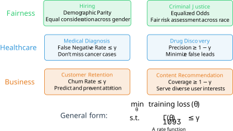
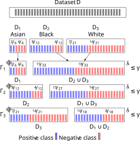

# Can We Train Fair ML Models Without Sacrificing Privacy?

**Mohammad Yaghini, Tudor Cebere, Michael Menart, Aurélien Bellet, Nicolas Papernot**  
*ICLR 2026 · University of Toronto, Vector Institute, Inria*

Training a machine learning model is, at its core, an optimization problem. In practice, however, minimizing a loss function is rarely sufficient. Models deployed in high-stakes settings must also satisfy behavioral requirements.

Consider a hiring algorithm that must treat applicants equitably regardless of gender. A criminal risk assessment tool that should be equally calibrated across racial groups. A medical diagnostic system that cannot exhibit differential miss rates across demographic populations. These are not edge cases; they represent core requirements in precisely the settings where machine learning is most consequential.

What unites all of these is that they can be expressed as **rate constraints**: conditions on a model's prediction rates across subpopulations. These settings share a further commonality: they involve sensitive personal data, making privacy a central concern as well.

The question we address is therefore:

> **Can we train ML models under rate constraints with formal differential privacy guarantees?**

## Why This Is Hard

Differential privacy (DP) operates by bounding how much any single training example can influence the learned model. In standard DP-SGD, this is straightforward: the loss decomposes over examples, so each individual's gradient is well-defined, clippable, and amenable to noise addition.

Rate constraints break this structure. A constraint such as "the false positive rate for Group A must be within 5% of Group B" is a function of the *entire* dataset, not of any single example.

Concretely, if one naively adds a regularizer to enforce a rate constraint and attempts to privatize it, each sample contributes up to **$|D| + 1$ terms** to the gradient rather than just one. Privatizing this requires noise proportional to that sensitivity, which renders the trained model essentially useless.

## Our Insight: Rate Constraints Have Structure

The central observation is that rate constraints are not arbitrary dataset-level functions. They always take a particular form: **prediction rates aggregated over subgroups**, where those subgroups arise from a natural partition of the data.

Consider demographic parity across three racial groups. Rather than a single constraint over the full dataset, one can decompose it into three subgroup-level constraints:

- **Asian vs. Non-Asian**
- **Black vs. Non-Black**
- **White vs. Non-White**

For any individual in the dataset, it is possible to determine, prior to any gradient computation, that this person will contribute exactly **3 + 1 terms** to the regularizer: one per constraint plus one for the standard loss. This is a fixed, bounded quantity that does not depend on $|D|$.

This structural property is the foundation of our approach. We formalize it through the notion of **generalized rate constraints** and show that all standard group fairness criteria, including demographic parity, equalized odds, and false negative rate bounds, can be expressed in this form.

## The Algorithm: RaCO-DP

Our method, **RaCO-DP** (Rate-Constrained Optimization with Differential Privacy), rewrites constraint evaluation to operate on a *privatized histogram* of model predictions.

At each step, rather than evaluating the rate constraint directly on the training data (which would incur fresh privacy cost at every iteration), the algorithm proceeds as follows:

1. **Compute a histogram** over the mini-batch: for each subgroup and each class, accumulate the softmax predictions.
2. **Privatize the histogram once** using the Laplace mechanism. Because each sample belongs to exactly one subgroup and its softmax outputs sum to one, the sensitivity is exactly 1, making this step inexpensive.
3. **Derive all downstream quantities** from the private histogram via post-processing: both the constraint values (dual update) and the per-sample regularizer gradients (primal update).

Post-processing a differentially private quantity incurs no additional privacy cost, by the post-processing immunity property of DP. The histogram provides all necessary information, and privacy is consumed only once per step.

The overall procedure is a differentially private variant of **Stochastic Gradient Descent-Ascent (SGDA)** applied to the Lagrangian formulation of the constrained problem. We prove convergence to an approximate stationary point for non-convex models and provide a novel analysis that exploits the linear structure of the dual update to achieve convergence rates of $1/T^{1/4}$, an improvement over the $1/T^{1/6}$ rates of prior approaches.

## Empirical Results

We evaluated RaCO-DP across multiple datasets, fairness constraint types, and model architectures.

**On tabular data** (Adult, Credit-Card, Parkinsons), RaCO-DP under ε = 1 differential privacy effectively closed the gap to non-private models in the accuracy-fairness Pareto frontier. 

**At scale**, with 18 simultaneous demographic parity constraints on the ACSEmployment dataset, the method continues to perform well, confirming that it does not degrade under a large constraint set.

**On deep networks**, a ResNet16 trained on CelebA achieves 90% accuracy with only 10% demographic disparity at ε = 1, a combination that was not previously achievable at this privacy budget.

**Constraint satisfaction** is guaranteed by construction. Prior regularization-based methods (including DP-FERMI) require careful hyperparameter tuning to approximately satisfy a fairness budget, and that tuning itself consumes privacy. With RaCO-DP, the constraint level γ is specified directly and enforced by the algorithm.

**Computational cost** is substantially reduced: RaCO-DP is approximately **three orders of magnitude faster** than DP-FERMI on equivalent hardware.

## Implications

A prevailing assumption in the field has been that differential privacy and fairness constraints are in fundamental tension, and that enforcing one necessarily compromises the other. Our results indicate that this tension is considerably weaker than previously believed, and appears to be largely an artifact of suboptimal algorithm design.

With the right algorithmic framework, it is possible to obtain strong differential privacy guarantees, directly enforced fairness constraints, and high model utility simultaneously.
